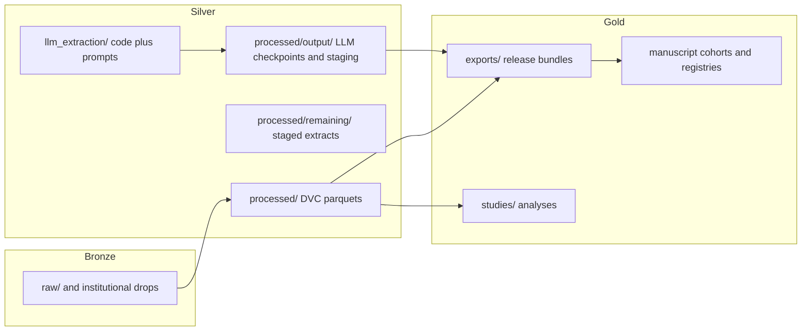

# Repository architecture v2 (2026-04-02)

This document describes the top-level layout after consolidation of LLM extraction code and medallion-style data tiers. PHI policies are unchanged: `raw/` remains gitignored; clinical note text is not committed.

## Medallion flow



## Where things live

| Concern | Location | Notes |
|--------|-----------|--------|
| Regex + LLM extractors, audit engines | [`llm_extraction/`](../llm_extraction/) | Import package `llm_extraction`; expanded prompts in `llm_extraction/prompts/` |
| Legacy shared prompts (e.g. lab date) | [`prompts/`](../prompts/) | Top-level prompt text used by multiple pipelines |
| DVC-tracked analytic parquets | [`processed/*.parquet`](../processed/) | Sidecar `.dvc` files; do not move paths without updating DVC |
| LLM checkpoints / `v2_parquets` | [`processed/output/`](../processed/output/) | Parquet outputs may be gitignored; checkpoints may be committed |
| Study / forensics artifacts (historically `outputs/`) | [`processed/outputs/`](../processed/outputs/) | Manuscript forensics, lobectomy molecular outputs, etc. |
| Publication exports | [`exports/`](../exports/) | Often gitignored patterns for large bundles |
| Bronze documentation | [`lakehouse/bronze/README.md`](../lakehouse/bronze/README.md) | Source-of-truth is encrypted/local `raw/` |
| Operational Makefile helpers | [`Makefile`](../Makefile) | e.g. `make verify-provenance`, promotion dry-runs |

## Commands (orientation)

```bash
# LLM / regex extraction (see README for tokens)
.venv/bin/python llm_extraction/run_extraction.py --workers 3 --input processed/clinical_notes_long.parquet

# Provenance audit (read-only verify)
make verify-provenance

# Full provenance materialization (mutates target DuckDB)
.venv/bin/python scripts/46_provenance_audit.py --md
```

## Related docs

- [`data_dictionary.md`](../data_dictionary.md) — schema and provenance policy
- [`docs/analysis_resolved_layer.md`](analysis_resolved_layer.md) — manuscript-ready resolved layer
