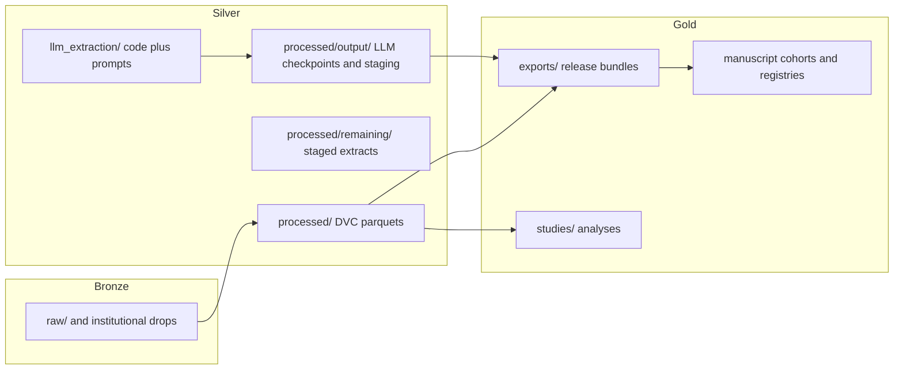

# Repository architecture v2 (2026-04-02)

This document describes the top-level layout after consolidation of LLM extraction code and medallion-style data tiers. PHI policies are unchanged: `raw/` remains gitignored; clinical note text is not committed.

## Medallion flow



## Where things live

| Concern | Location | Notes |
|--------|-----------|--------|
| Regex + LLM extractors, audit engines | [`llm_extraction/`](../llm_extraction/) | Import package `llm_extraction`; expanded prompts in `llm_extraction/prompts/` |
| Legacy shared prompts (e.g. lab date) | [`prompts/`](../prompts/) | Top-level prompt text used by multiple pipelines |
| DVC-tracked analytic parquets | [`processed/*.parquet`](../processed/) | Sidecar `.dvc` files; do not move paths without updating DVC |
| LLM checkpoints / `v2_parquets` | [`processed/output/`](../processed/output/) | Parquet outputs may be gitignored; checkpoints may be committed |
| Study / forensics artifacts (historically `outputs/`) | [`processed/outputs/`](../processed/outputs/) | Manuscript forensics, lobectomy molecular outputs, etc. |
| Publication exports | [`exports/`](../exports/) | Often gitignored patterns for large bundles |
| Bronze documentation | [`lakehouse/bronze/README.md`](../lakehouse/bronze/README.md) | Source-of-truth is encrypted/local `raw/` |
| Operational Makefile helpers | [`Makefile`](../Makefile) | e.g. `make verify-provenance`, promotion dry-runs |

## Commands (orientation)

```bash
# LLM / regex extraction (see README for tokens)
.venv/bin/python llm_extraction/run_extraction.py --workers 3 --input processed/clinical_notes_long.parquet

# Provenance audit (read-only verify)
make verify-provenance

# Full provenance materialization (mutates target DuckDB)
.venv/bin/python scripts/46_provenance_audit.py --md
```

## Related docs

- [`data_dictionary.md`](../data_dictionary.md) — schema and provenance policy
- [`docs/analysis_resolved_layer.md`](analysis_resolved_layer.md) — manuscript-ready resolved layer
- [`docs/motherduck_database_contract_v1.md`](motherduck_database_contract_v1.md) — includes **specimen identity** (`specimen_*_v1`) and **analytic FHIR export** (`fhir_*_v1`) materialized by `scripts/138_md_specimen_fhir_layer.py`; **NDJSON bundle export** to `exports/fhir_specimen_<ts>/` via [`scripts/141_fhir_specimen_json_export.py`](../scripts/141_fhir_specimen_json_export.py) (`specimen_fhir_export_restore_v1` UA, bundle table preferred + resource-table reconstruction fallback; `manifest.json` lists `source_catalog`, `source_views`, `from_prebuilt_bundle_view`; `--local-duckdb` for offline runs)

### Specimen + analytic FHIR (v1)

Canonical specimen rows key off `synoptic_tumor_long_v1` + `path_synoptics_encounter_qc_v1` (multi-synoptic isolation) and `surgery_pathology_linkage_v3`. Genomics bind via `fna_molecular_linkage_v3` → `preop_surgery_linkage_v3` → specimen focus (plus deterministic `genetic_testing` → `molecular_test_episode_v2` platform match in script 138). FHIR tables are **de-identified JSON stubs** for research exports, not a full clinical exchange gate. **Release QA:** `scripts/sql/142_specimen_fhir_qa_diagnostics_ddl.sql` (`qa.v_diag_*`) wired into `119_md_formalization_validate.py` Check 13; deploy path documented in [`docs/specimen_fhir_contract_review.md`](specimen_fhir_contract_review.md).
