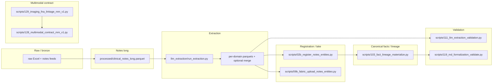

# Architecture map — raw data → release (evidence-backed)

**Audit date:** 2026-04-07  
**Repo HEAD:** `2d18dd2aa668b0211c69de9792084747f365d84a` (branch `main`, tracking `origin/main`).  
**Scope:** Code and config only; live MotherDuck row counts need auth. Agents often store RW keys in **gitignored** `.streamlit/secrets.toml` (`MOTHERDUCK_TOKEN`, `MD_SA_TOKEN`); `motherduck_client.get_token()` loads them when env vars are unset. The audit run used a shell with no env tokens and did not load TOML for queries.

## End-to-end flow (conceptual)

## 1. Raw → notes long

- **README** positions LLM staging under `processed/` and registry SSOT at `config/extraction_domain_registry.yaml` (`README.md` “Dataset Maturation Layer”).

## 2. Extraction (registry-driven)

- **Registry:** `config/extraction_domain_registry.yaml` declares v1 domains, a legacy `llm` merged-audit stem (`note_entities_llm`, `canonical_output: false`), and v2 domains each with `parquet_stem: note_entities_llm_<domain>` and `canonical_output: true` where promoted (e.g. `imaging` at lines 138–150 of the YAML file read in this audit).

- **Runner:** `llm_extraction/run_extraction.py`:
  - Documents per-domain v2 outputs and optional merged audit (`note_entities_llm.parquet` only with `--merge-audit`) in the module docstring (lines 22–31).
  - `run_llm_for_domain` sets `rec["entity_domain"] = domain_name` and calls `llm.extract(..., domain=domain_name)` (lines 275–326).

- **LLM class default vs row output:** `LLMExtractor.entity_domain = "llm"` (`llm_extraction/extract_llm.py` line 68) is the **class** default; the runner **overrides** per-row domain when persisting v2 outputs (see `run_llm_for_domain` above).

- **Prompt selection:** `_load_system_prompt` uses `load_registry().prompt_for_domain(domain)` — **first prompt only** when `domain` is set (`llm_extraction/extract_llm.py` lines 160–166). Multi-prompt v1 domains in YAML (e.g. `genetics` with two prompt files) require callers to use `prompts_for_domain` for full coverage; `LLMExtractor` does not iterate multiple prompts automatically.

## 3. Validation — LLM sidecar

- **Script 111** (`scripts/111_llm_extraction_validation.py`):
  - Primary docstring still describes default input as merged `note_entities_llm.parquet` (lines 5–6).
  - CLI supports `--domain`, `--all-llm-domains`, and legacy `--input` (lines 156–187).
  - **Fail-closed behavior:** if no `--domain` / `--all-llm-domains` / `--input`, and `processed/note_entities_llm.parquet` is missing, exits with error directing operators to per-domain validation (lines 1651–1660).

## 4. Registration / Fabric

- **MotherDuck registration:** `scripts/02b_register_notes_entities.py` imports `connect_md_or_file` from `utils/md_connect` (grep hit at lines 26, 204).

- **Fabric / OneLake:** `scripts/09b_fabric_upload_notes_entities.py` uses Azure REST + registry-driven `DOMAIN_TO_FILE`; **no** `utils.md_connect` (Fabric auth is Azure credential path per script docstring lines 13–15).

## 5. Canonical facts / lineage

- **Script 103** uses `connect_md_or_file` for MotherDuck paths (grep) but `_load_episode_source` uses **direct** `duckdb.connect(str(DB_PATH), read_only=True)` when loading episode tables from a local file fallback (`scripts/103_fact_lineage_materialize.py` lines 232–234). That path is **local read-only**, not MotherDuck.

## 6. Labs (Tg wave)

- **Script 113** uses `connect_md_or_file` when `use_md` is true (grep hits lines 126–128).

## 7. Multimodal contract

- **129** then **128** on MotherDuck are wired in **`.github/workflows/motherduck_episode_pipeline.yml`** (manual `workflow_dispatch`), steps “129 — imaging_fna_linkage_mm_v1” and “128 — multimodal_contract_mm_v1” (lines 101–120).

- **128 / 129** code: both use `connect_md_or_file` when `--md` and `duckdb.connect(str(DB_PATH))` for local file mode (grep).

## 8. CI vs release

- **`.github/workflows/ci.yml`** runs `multimodal-tests` with **pytest** on `tests/test_multimodal_contract_mm_v1.py` and `tests/test_imaging_fna_linkage_mm_v1.py` — **offline**. Optional **manual** `workflow_dispatch` job `multimodal-md-contract-gate` runs **129→128** with `--strict-release` on MotherDuck and uploads gate JSON artifacts.

- **Formalization / MotherDuck** jobs in `ci.yml` reference scripts 116/112/119 in header comments (lines 9–14); multimodal **deployment** to cloud is separate (episode pipeline workflow).

## 9. MotherDuck environments

- **`config/motherduck_environments.yml`**: `dev`, `qa`, and `prod` map to **different** `database` string values (lines 12–18).

- **`motherduck_client.py`**: default `_ENV_DATABASES` matches those three names (lines 63–67); `resolve_database_for_env` honors `MOTHERDUCK_DATABASE` / `MOTHERDUCK_DB` override (lines 138–149).

**Implication:** dev/qa/prod are **not** the same MotherDuck database unless operators override with `MOTHERDUCK_DATABASE` / `MOTHERDUCK_DB` to point all environments at one catalog.

---

## Files inspected (this document)

`README.md`, `AGENTS.md`, `config/extraction_domain_registry.yaml`, `llm_extraction/run_extraction.py`, `llm_extraction/extract_llm.py`, `scripts/111_llm_extraction_validation.py`, `scripts/02b_register_notes_entities.py`, `scripts/09b_fabric_upload_notes_entities.py`, `scripts/103_fact_lineage_materialize.py`, `scripts/113_tg_lab_ingestion.py`, `scripts/128_multimodal_contract_mm_v1.py`, `scripts/129_imaging_fna_linkage_mm_v1.py`, `utils/md_connect.py`, `motherduck_client.py`, `config/motherduck_environments.yml`, `.github/workflows/ci.yml`, `.github/workflows/motherduck_episode_pipeline.yml`, `.github/copilot-instructions.md`.
