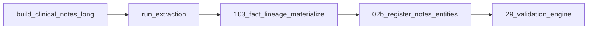

# Dataset hardening execution plan — 2026-04-01

## Current state (baseline)

- **Ingest / notes:** `scripts/build_clinical_notes_long.py` produces `processed/clinical_notes_long.parquet` with `source_workbook`, `excel_row_0based`, `ingest_script_version`, etc.
- **Extraction:** `llm_extraction/run_extraction.py` writes `processed/note_entities_<domain>.parquet`; regex + optional `LLMExtractor` (`llm_extraction/extract_llm.py`).
- **Schema:** `llm_extraction/vocab.py` defines `ENTITY_SCHEMA_COLUMNS` (includes `extraction_method`, `source_line`, verification fields, chunk/evidence globals, `date_confidence`, `raw_response_sha256`).
- **Canonical long:** `scripts/103_fact_lineage_materialize.py` unions entity parquets, merges clinical note provenance (`clin_*`), infers `inferred_surgery_episode_id` from `operative_episode_detail_v2`, writes `processed/canonical_extracted_fact_long_v1.parquet` and DuckDB table `canonical_extracted_fact_long_v1`.
- **Validation:** `scripts/29_validation_engine.py` defines `val_fact_provenance_v1` (row-level LLM QA) and `val_fact_release_metrics_v1` (release fill-rate metrics).
- **Episode safety:** `scripts/76_canonical_gap_closure.py` restricts some NLP rollups to single-surgery patients (comment reference to canonical fact long).
- **Registration:** `scripts/02b_register_notes_entities.py` loads notes + entity parquets; extended to load canonical, quarantine, and run telemetry tables when parquets exist.

## Files touched (by phase)

| Phase | Files |
|-------|--------|
| 1 | `docs/dataset_hardening_execution_plan_20260401.md` (this file) |
| 2–3–4 | `llm_extraction/vocab.py`, `llm_extraction/base.py`, `llm_extraction/run_telemetry.py`, `llm_extraction/run_extraction.py`, `llm_extraction/extract_llm.py`, `scripts/103_fact_lineage_materialize.py` |
| 5 | `scripts/29_validation_engine.py` |
| 6 | `docs/final_clean_dataset_release_spec_v1.md`, `docs/fact_provenance_contract_v1.md`, `docs/llm_extraction_verification_framework_v1.md` |
| 7 | `scripts/02b_register_notes_entities.py`, `config/extraction_domain_registry.yaml`, `README_FABRIC.md` |
| 8 | `tests/test_fact_provenance_contract.py` |
| DVC | `processed/*.parquet.dvc` for canonical, quarantine, runs (when tracked) |

## Tables and artefacts

| Artefact | Role |
|----------|------|
| `canonical_extracted_fact_long_v1` | Clean, analysis-ready long facts + full provenance contract |
| `canonical_fact_quarantine_v1` | Same schema + `quarantine_reason`, `quarantine_date`; conservative exclusions |
| `note_extraction_runs` | One row per extraction invocation (`success`, `failure_stage`, counts, warnings) |
| `val_fact_provenance_v1` | Row-level fact QA issues |
| `val_fact_release_metrics_v1` | Single-row release metrics (% fills, quarantine rate, LLM verification rate) |

## Rerun map



**Selective domain rerun:** `python llm_extraction/run_extraction.py --target <domain> [--research-ids ids.txt]` then always rerun `103_fact_lineage_materialize.py`, and `02b` / `29` if DuckDB must match parquet outputs.

## Exact command sequence — final clean dataset v1

```bash
cd THYROID_2026
.venv/bin/python scripts/build_clinical_notes_long.py
.venv/bin/python llm_extraction/run_extraction.py
.venv/bin/python scripts/103_fact_lineage_materialize.py
.venv/bin/python scripts/02b_register_notes_entities.py
.venv/bin/python scripts/29_validation_engine.py
# Optional: dvc add processed/canonical_extracted_fact_long_v1.parquet ...
```

## Scope guardrails

- Do **not** change manuscript-facing pipeline outputs beyond this notes/canonical/validation surface unless explicitly required.
