# Operator flow map — release orchestration vs specimen/FHIR (2026-04-07)

This map shows **which scripts run in which default orchestrators** and where **specimen / FHIR** materialization fits relative to **release-mode validation (`119`)**.

## High-level flow

```mermaid
flowchart TD
  subgraph extract_local [Local extraction]
    R116[116_md_stage_loader]
    R112[112_v2_domain_promotion_gate]
    R103[103_fact_lineage_materialize]
    R114[114_qa_schema_setup]
    R117[117_md_contract_views]
    R132[132_molecular_fact_lineage_views]
    R125[125_master_verified_views]
  end

  subgraph specimen_optional [Specimen / FHIR optional branch]
    R138[138_md_specimen_fhir_layer]
    R143[143_md_specimen_fhir_qa_diagnostics_deploy]
  end

  subgraph release_bundle [Release artifacts]
    R115[115_release_snapshot]
    R118[118_parquet_release_bundle]
  end

  R124[124_md_live_release_audit]
  R126[126_final_master_release]
  R137[137_md_molecular_release_workflow]
  R119[119_md_formalization_validate release-mode]

  R124 --> R116
  R124 --> R112
  R124 --> R103
  R124 --> R114
  R124 --> R117
  R124 --> R132
  R124 --> R125
  R124 --> R115
  R124 --> R118
  R124 --> R119

  R138 --> R143
  R138 -.->|must precede 119 Check 13 when anchors exist| R119
  R143 -.->|deploys qa.v_diag_* only| R119

  R126 --> R114
  R126 --> R103
  R126 --> R117
  R126 --> R115
  R126 --> R118
  R126 --> R119

  R137 --> R130[130_md_env_bootstrap]
  R137 --> R136w[136 writer]
  R137 --> R119qa[119 QA catalog]
  R137 --> R124
  R137 --> R136r[136 reader]
```



## Orchestrator contents (verbatim roles)

| Orchestrator | Specimen/FHIR materialization (`138` / `143`) | Release-mode `119` | Notes |
|--------------|-----------------------------------------------|--------------------|--------|
| **`124_md_live_release_audit.py`** | **Not** in default step list | **Yes** (final step when `--final-release`) | Docstring enumerates 116→112→103→114→117→132→125→115→118→119 |
| **`126_final_master_release.py`** | **Not** in docstring chain | **Yes** (step 7) | Steps 6a/6b explicitly **exclude** specimen/FHIR from snapshot/bundle |
| **`137_md_molecular_release_workflow.py`** | **Not** invoked | **Yes** (`qa-validate` + end of `124`) | Chains backup/snapshots/119 QA/`124`/reader refresh |

## Where `119` enforces specimen/FHIR

`119` docstring Check 13 references `scripts/138_md_specimen_fhir_layer.py` and diagnostic views:

```38:41:scripts/119_md_formalization_validate.py
 13. Specimen + analytic FHIR layer (scripts/138_md_specimen_fhir_layer.py): table presence when
     synoptic_tumor_long_v1 exists; fingerprint uniqueness; qa.val_specimen_contract_v1 and
     qa.val_specimen_genomic_binding_v1 FAIL rows; qa.v_diag_* diagnostic views (142) orphan/ref/
     duplicate/provenance checks; specimen-adjacent review burden (informational)
```

So: **`119` validates** the layer when anchor objects exist; **`124` / `126` / `137` do not, by default, rebuild** it.

## Env routing (dev / qa / prod)

| Mechanism | Evidence |
|-----------|----------|
| YAML catalog map | `config/motherduck_environments.yml` `environments.dev|qa|prod.database` |
| Client resolution | `motherduck_client.py` `resolve_database_for_env()` |
| `124` / `117` / `119` | `--md-env` forwarded when set (`124` sets `MOTHERDUCK_DATABASE` from env) |

## Manual review queue gates

| Script | Pending definition | Strict? |
|--------|-------------------|---------|
| `124` `check_pending_reviews` | `WHERE verification_status IS NULL` when `--final-release` | Halts before continuing |
| `119` `check_review_queue` | `pending = total - COUNT(* WHERE verification_status IS NOT NULL)` when `--release-mode` | FAIL if `pending > 0` |

Both treat any **non-NULL** verification as resolved (see `release_gap_list_20260407.md` for synthetic-status gap).

---

*For MotherDuck connection/token modes, see `docs/motherduck_database_contract_v1.md` §8 and `utils/md_connect.py`.*
