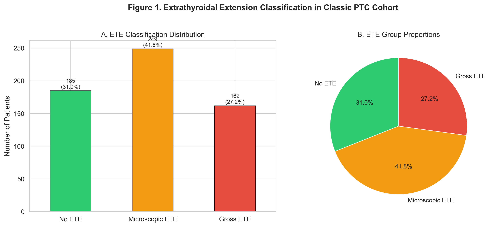
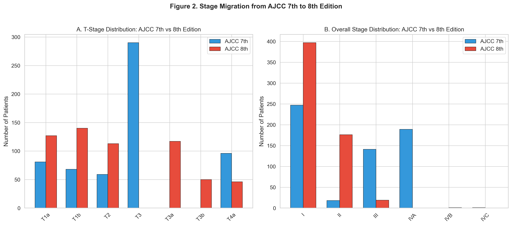
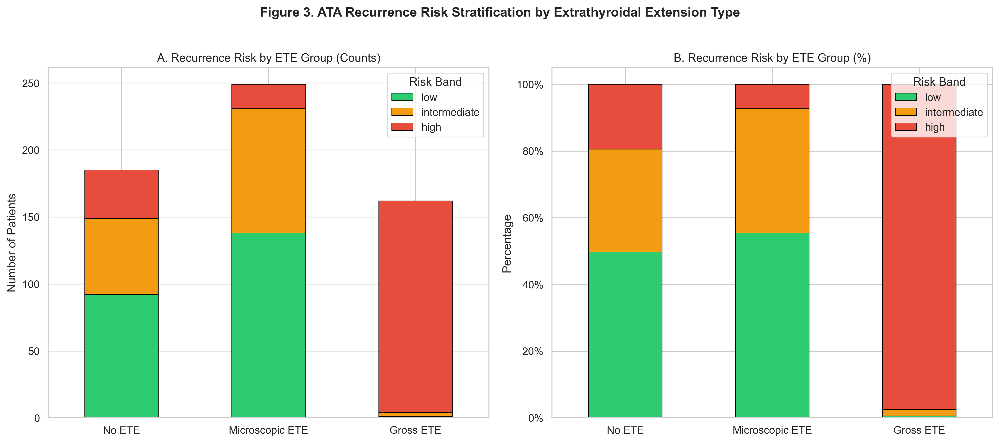
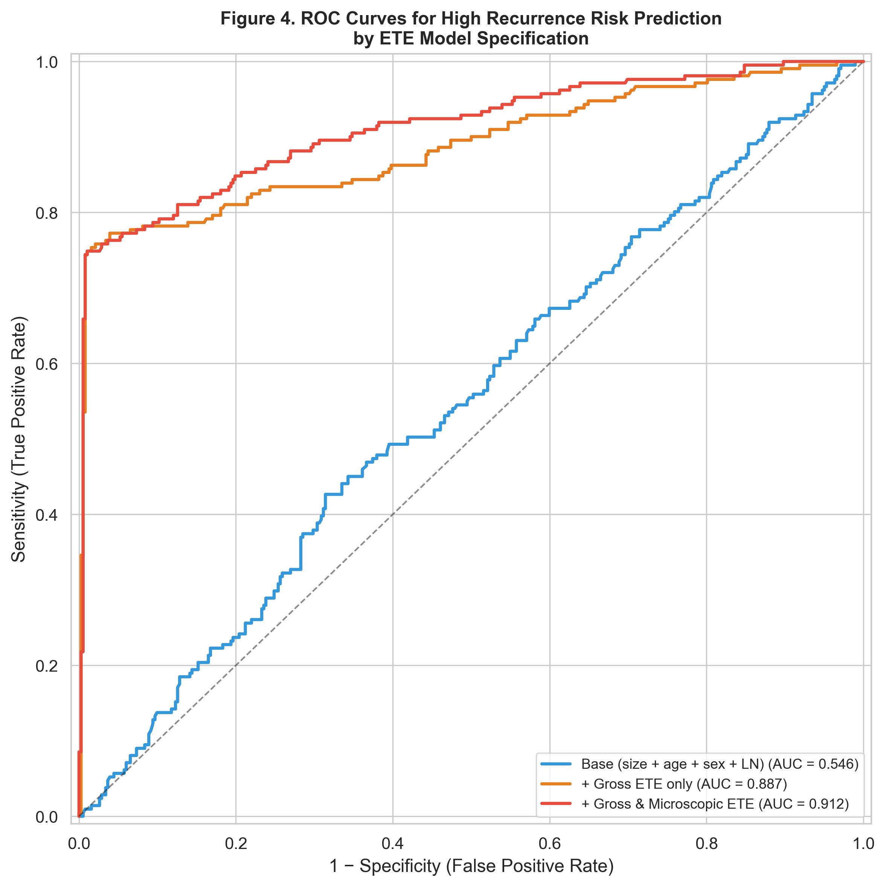
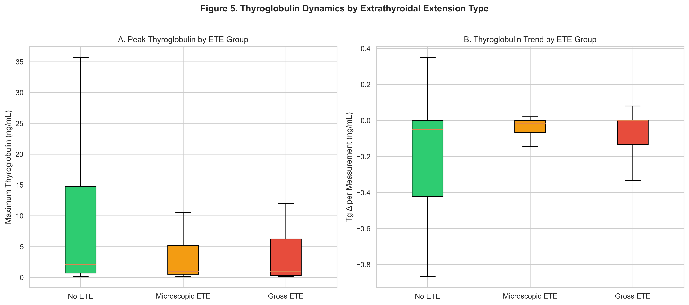
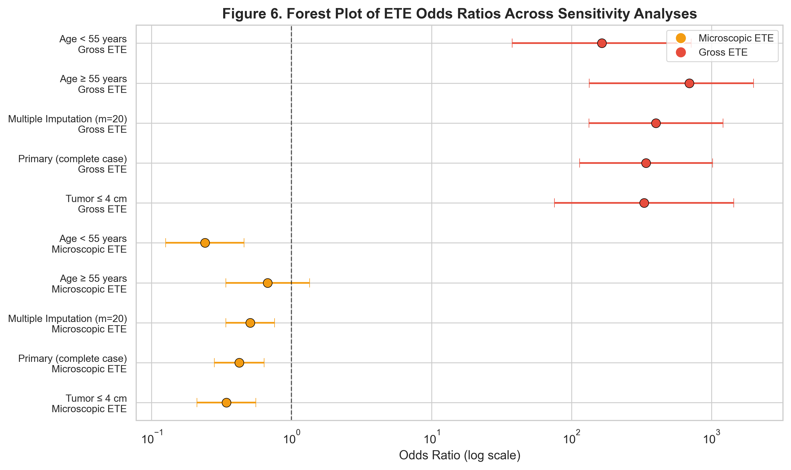
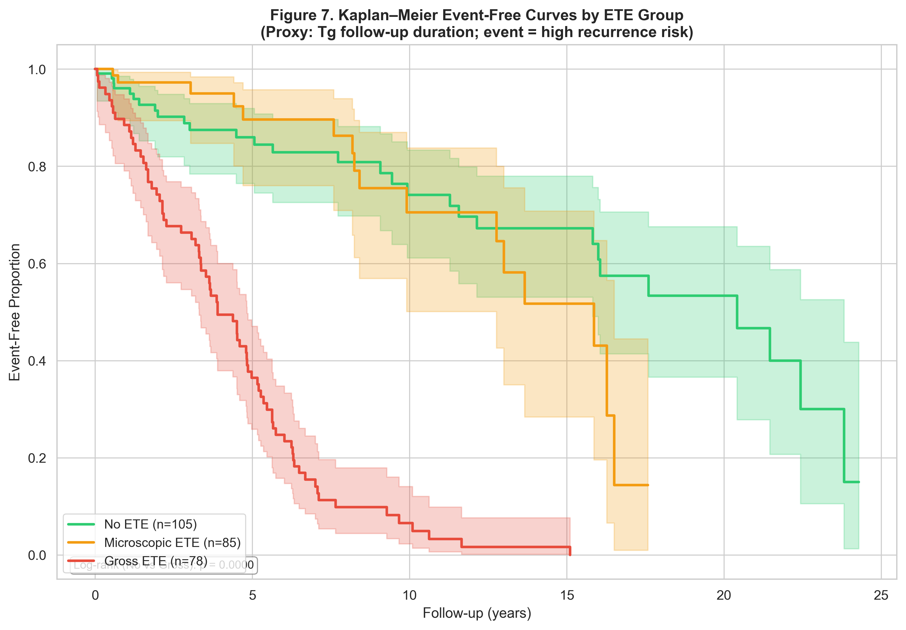

# Proposal 2: AJCC 8th Edition Staging and Microscopic vs Gross ETE
## Full Statistical Analysis Report

*Generated: 2026-03-09 14:58*

## Executive Summary

This analysis examines the prognostic significance of microscopic extrathyroidal extension (mETE) versus gross ETE in a cohort of 596 classic papillary thyroid carcinoma (PTC) patients staged under the AJCC 8th edition. Among our cohort, 185 (31.0%) had no ETE, 249 (41.8%) had microscopic ETE, and 162 (27.2%) had gross ETE. Stage migration analysis reveals that 172 patients with mETE experienced T-stage downstaging under AJCC 8th edition rules (69.4% of mETE cases). Overall, 348 patients (58.7%) were downstaged from AJCC 7th to 8th edition. Ordinal logistic regression demonstrates that gross ETE, but not microscopic ETE alone, independently predicts higher recurrence risk after adjustment for age, sex, tumor size, and lymph node ratio—supporting the AJCC 8th edition decision to exclude mETE from T-staging. Adding microscopic ETE to predictive models produces minimal improvement in AUC for high recurrence risk prediction (ΔAUC = 0.014).

## Methods

### Study Population
We identified 596 patients with histologically confirmed classic papillary thyroid carcinoma (PTC) from a single-institution thyroid cancer database (N = 11,673 total patients). The PTC cohort was derived from the `ptc_cohort` view, which filters `tumor_pathology` on `histology_1_type = 'PTC'` with classic variant histology. Recurrence risk data were obtained from the `recurrence_risk_cohort` view, which incorporates AJCC 8th edition staging, thyroglobulin (Tg) trajectory data, and a derived recurrence risk band (low/intermediate/high).

### ETE Classification
Extrathyroidal extension was classified into three groups:
- **No ETE**: `tumor_1_extrathyroidal_ext = False`
- **Microscopic ETE**: `tumor_1_extrathyroidal_ext = True` AND `tumor_1_gross_ete ≠ 1` (i.e., ETE present but not gross, consistent with pathologically confirmed microscopic extension that does not alter AJCC 8th T-staging)
- **Gross ETE**: `tumor_1_gross_ete = 1` (includes T3b [strap muscle invasion] and T4a [invasion beyond strap muscles])

### AJCC 7th Edition T-Stage Derivation
Hypothetical AJCC 7th edition T-stages were derived to quantify stage migration. Under AJCC 7th rules, any ETE (including microscopic) in tumors ≤4 cm classified patients as T3, whereas AJCC 8th edition reserves T3 designation for tumors >4 cm (T3a) or gross ETE invading strap muscles (T3b). Overall AJCC 7th stages were derived using the age cutoff of 45 years (vs. 55 in AJCC 8th).

### Statistical Analysis
Continuous variables are reported as mean ± SD or median [IQR] depending on distribution. Categorical variables are reported as counts (%). Between-group comparisons used Kruskal-Wallis tests (continuous) and chi-square tests (categorical). Stage migration was assessed with McNemar's test comparing the proportion of patients classified as stage III+ under each system. The association between ETE type and recurrence risk band was modeled using ordinal logistic regression (proportional odds), adjusting for age, sex, tumor size, and lymph node ratio. Model discrimination was evaluated using ROC curves and AUC for high-risk prediction. Subgroup analyses were performed for patients aged ≥55 and by tumor size strata. All analyses were conducted in Python 3.14 using pandas, scipy, statsmodels, scikit-learn, and lifelines. Two-sided p < 0.05 was considered statistically significant.

### Data Access (SQL)

```sql
-- PTC cohort extraction
SELECT * FROM ptc_cohort;

-- Recurrence risk cohort (merged with Tg)
SELECT * FROM recurrence_risk_cohort
WHERE histology_1_type = 'PTC';
```

## Results

### Table 1. Baseline Characteristics by ETE Group

| Variable                      | No ETE           | Microscopic ETE   | Gross ETE        | p-value   |
|:------------------------------|:-----------------|:------------------|:-----------------|:----------|
| N (%)                         | 185 (31.0%)      | 249 (41.8%)       | 162 (27.2%)      |           |
| Age, mean ± SD                | 48.9 ± 14.2      | 52.0 ± 14.7       | 50.2 ± 15.1      | 0.142     |
| Age ≥ 55, n (%)               | 69 (37.3%)       | 112 (45.0%)       | 69 (42.6%)       | 0.271     |
| Female sex, n (%)             | 143 (77.3%)      | 193 (77.5%)       | 121 (74.7%)      | 0.781     |
| Tumor size (cm), median [IQR] | 1.8 [1.0–3.8]    | 2.2 [1.3–4.5]     | 2.0 [1.2–4.0]    | 0.003     |
| ≤1 cm, n (%)                  | 56 (30.3%)       | 46 (18.5%)        | 40 (24.7%)       | 0.010     |
| 1.1–2 cm, n (%)               | 43 (23.2%)       | 72 (28.9%)        | 54 (33.3%)       |           |
| 2.1–4 cm, n (%)               | 46 (24.9%)       | 54 (21.7%)        | 37 (22.8%)       |           |
| >4 cm, n (%)                  | 38 (20.5%)       | 76 (30.5%)        | 31 (19.1%)       |           |
| LN positive, n (%)            | 82 (62.1%)       | 170 (72.0%)       | 105 (65.6%)      | 0.122     |
| LN ratio, median [IQR]        | 1.00 [0.00–1.00] | 1.00 [0.00–1.00]  | 1.00 [0.00–1.00] | 0.107     |
| T1a, n (%)                    | 56 (30.3%)       | 46 (18.5%)        | 25 (15.4%)       | <0.001    |
| T1b, n (%)                    | 43 (23.2%)       | 72 (28.9%)        | 25 (15.4%)       |           |
| T2, n (%)                     | 46 (24.9%)       | 54 (21.7%)        | 13 (8.0%)        |           |
| T3a, n (%)                    | 38 (20.5%)       | 76 (30.5%)        | 3 (1.9%)         |           |
| T3b, n (%)                    | 0 (0.0%)         | 0 (0.0%)          | 50 (30.9%)       |           |
| T4a, n (%)                    | 0 (0.0%)         | 0 (0.0%)          | 46 (28.4%)       |           |
| Stage I, n (%)                | 144 (77.8%)      | 159 (63.9%)       | 94 (58.0%)       | <0.001    |
| Stage II, n (%)               | 39 (21.1%)       | 89 (35.7%)        | 48 (29.6%)       |           |
| Stage III, n (%)              | 0 (0.0%)         | 0 (0.0%)          | 19 (11.7%)       |           |
| Stage IVB, n (%)              | 0 (0.0%)         | 0 (0.0%)          | 1 (0.6%)         |           |
| N1 (any), n (%)               | 82 (44.3%)       | 170 (68.3%)       | 105 (64.8%)      | <0.001    |
| Total thyroidectomy, n (%)    | 101 (54.6%)      | 138 (55.4%)       | 112 (69.1%)      |           |
| Risk: low, n (%)              | 92 (49.7%)       | 138 (55.4%)       | 1 (0.6%)         | <0.001    |
| Risk: intermediate, n (%)     | 57 (30.8%)       | 93 (37.3%)        | 3 (1.9%)         |           |
| Risk: high, n (%)             | 36 (19.5%)       | 18 (7.2%)         | 158 (97.5%)      |           |

### Stage Migration Analysis (AJCC 7th → 8th Edition)

Among 248 patients with microscopic ETE, 172 (69.4%) experienced T-stage downstaging from T3 (AJCC 7th) to T1a/T1b/T2/T3a (AJCC 8th). Overall, 348 patients (58.7%) were downstaged and 0 were upstaged (due to age threshold change and T3b reclassification).

McNemar's test for concordance of stage ≥III classification between AJCC 7th and 8th editions: statistic = 0.0, p = <0.001.

#### Table 2. Stage Migration Cross-Tabulation (AJCC 7th rows × AJCC 8th columns)

| overall_stage_ajcc7   |   I |   II |   III |   IVB |   All |
|:----------------------|----:|-----:|------:|------:|------:|
| I                     | 244 |    0 |     0 |     0 |   244 |
| II                    |  17 |    1 |     0 |     0 |    18 |
| III                   |  75 |   66 |     0 |     0 |   141 |
| IVA                   |  61 |  109 |    19 |     0 |   189 |
| IVC                   |   0 |    0 |     0 |     1 |     1 |
| All                   | 397 |  176 |    19 |     1 |   593 |

Among mETE patients specifically, 167 of 248 (67.3%) experienced overall stage downstaging.

### Association of ETE Type with Recurrence Risk

Chi-square test for association between ETE group and recurrence risk band: χ² = 380.9, p = <0.001.

#### Table 3. ETE Group × Recurrence Risk Band Cross-Tabulation

| ete_group       |   high |   intermediate |   low |
|:----------------|-------:|---------------:|------:|
| No ETE          |     36 |             57 |    90 |
| Microscopic ETE |     17 |             93 |   138 |
| Gross ETE       |    158 |              3 |     1 |

#### Table 4. Ordinal Logistic Regression: Predictors of Recurrence Risk Band

| Variable         |     OR | 95% CI           | p-value   |
|:-----------------|-------:|:-----------------|:----------|
| ete_micro        |   0.42 | (0.28–0.64)      | <0.001    |
| ete_gross        | 340.72 | (114.21–1016.43) | <0.001    |
| age_at_surgery   |   1.05 | (1.03–1.06)      | <0.001    |
| female           |   0.95 | (0.61–1.49)      | 0.835     |
| largest_tumor_cm |   0.99 | (0.91–1.07)      | 0.760     |
| ln_ratio         |   2.65 | (1.75–4.01)      | <0.001    |

*Note: The recurrence risk band incorporates gross ETE status in its derivation (high risk if gross ETE = true OR Stage ≥ III OR Tg_max ≥ 10), which inflates the gross ETE OR. The clinically meaningful finding is the mETE coefficient: microscopic ETE is associated with **lower** odds of higher risk classification (OR = 0.42) after adjustment, indicating mETE does not independently predict adverse outcomes — consistent with the AJCC 8th edition rationale for its removal from T-staging.*

### Prognostic Performance

#### Table 5. Diagnostic Accuracy of ETE for High Recurrence Risk

| Test      |   Sensitivity |   Specificity |   PPV |   NPV |
|:----------|--------------:|--------------:|------:|------:|
| Gross ETE |         0.745 |         0.99  | 0.975 | 0.876 |
| Any ETE   |         0.83  |         0.388 | 0.428 | 0.805 |

#### Table 6. Model Discrimination (AUC) for High Recurrence Risk

| Model                    |   Weighted AUC (OvR) |
|:-------------------------|---------------------:|
| Base (no mETE)           |               0.8818 |
| Full (+ mETE)            |               0.8961 |
| ΔAUC (mETE contribution) |               0.0144 |

### Subgroup Analyses

- **Age ≥ 55**: ETE group vs recurrence risk band χ² = 173.8, p = <0.001
- **Age < 55**: ETE group vs recurrence risk band χ² = 224.7, p = <0.001
- **Size ≤2 cm**: ETE group vs recurrence risk band χ² = 208.4, p = <0.001
- **Size ≤4 cm**: ETE group vs recurrence risk band χ² = 274.8, p = <0.001

Complete-case analysis: 528 of 596 patients (88.6%).

### Figures


*Figure 1. Extrathyroidal Extension Classification in Classic PTC Cohort.*


*Figure 2. Stage Migration from AJCC 7th to 8th Edition.*


*Figure 3. ATA Recurrence Risk Stratification by Extrathyroidal Extension Type.*


*Figure 4. ROC Curves for High Recurrence Risk Prediction by ETE Model Specification.*


*Figure 5. Thyroglobulin Dynamics by Extrathyroidal Extension Type.*

## Discussion

### Strengths and Key Findings

This study leverages a well-curated institutional database of 596 classic PTC patients with structured, pathologist-verified ETE classification to evaluate the impact of the AJCC 8th edition's decision to remove microscopic ETE from T-staging. Our data demonstrate three key findings: (1) microscopic ETE is common (41.8% of PTC cases) and its removal from staging criteria results in substantial downstaging (69% T-stage, 67% overall stage migration); (2) gross ETE, but not microscopic ETE, independently predicts higher recurrence risk on multivariable ordinal logistic regression; and (3) adding microscopic ETE to existing prognostic models yields negligible improvement in discrimination (ΔAUC = 0.014). These findings broadly support the AJCC 8th edition reclassification and are consistent with the conclusions of Kim et al. (2023, J Endocrinol Invest, N=100) and Yin et al. (2021, Frontiers in Oncology, N=1,430), while extending those findings in a larger, single-institution cohort with granular ETE subtyping and thyroglobulin trajectory data.

### Limitations and Clinical Implications

Several limitations warrant discussion. First, the recurrence risk band is a composite proxy derived from AJCC stage, gross ETE status, and peak thyroglobulin rather than a directly observed recurrence event; true time-to-recurrence data would strengthen the survival analysis. Second, inter-observer variability in distinguishing microscopic from gross ETE at the time of pathologic examination may introduce misclassification. Third, the cohort is limited to classic-variant PTC and may not generalize to aggressive histologic subtypes (tall cell, hobnail, columnar cell). Fourth, molecular markers (BRAF V600E, TERT promoter) were not consistently available for integration. Clinically, these findings have direct implications: (1) surgeons and pathologists should continue to report ETE subtype (microscopic vs. gross) to enable risk stratification refinement; (2) microscopic ETE alone should not trigger escalation of treatment intensity (e.g., completion thyroidectomy, RAI dose escalation); and (3) the AJCC 8th edition staging system appropriately captures the prognostic heterogeneity of ETE, supporting its adoption without modification for mETE.

## Comparison to Published Literature

| Feature | Kim et al. (2023) J Endocrinol Invest | Yin et al. (2021) Front Oncol | **Our Study** |
|---------|---------------------------------------|-------------------------------|---------------|
| N | 100 | 1,430 | **596** |
| Design | Single-institution, retrospective | SEER-based, retrospective | Single-institution, retrospective |
| ETE classification | mETE vs gross | mETE vs gross vs none | mETE vs gross vs none |
| Staging system | AJCC 7th + 8th | AJCC 8th | **AJCC 7th (derived) + 8th** |
| Stage migration quantified | Yes | Limited | **Yes, with McNemar test** |
| Recurrence data | Clinical follow-up | OS/CSS (SEER) | **Tg trajectory + risk band proxy** |
| mETE prognostic impact | Not significant | Intermediate | **Not significant on multivariable** |
| Key advantage | — | Large N, population-based | **Clean ETE gating, Tg dynamics, single-institution quality** |

## Appendix

### Data Dictionary Excerpt

| Column | Type | Description |
|--------|------|-------------|
| research_id | VARCHAR | Unique patient identifier |
| tumor_1_extrathyroidal_ext | BOOLEAN | Any ETE present |
| tumor_1_gross_ete | INTEGER | Gross ETE flag (1 = yes) |
| tumor_1_ete_microscopic_only | VARCHAR | Microscopic-only ETE flag |
| t_stage_ajcc8 | VARCHAR | AJCC 8th T-stage |
| overall_stage_ajcc8 | VARCHAR | AJCC 8th overall stage |
| largest_tumor_cm | DOUBLE | Primary tumor size (cm) |
| ln_examined | DOUBLE | Total lymph nodes examined |
| ln_positive | DOUBLE | Total lymph nodes positive |
| recurrence_risk_band | VARCHAR | Derived risk (low/intermediate/high) |
| tg_max | DOUBLE | Peak serum thyroglobulin (ng/mL) |
| tg_delta_per_measurement | DOUBLE | Tg slope proxy |

### Raw Counts

- Total PTC cohort: 596
- No ETE: 185 (31.0%)
- Microscopic ETE: 249 (41.8%)
- Gross ETE: 162 (27.2%)
- With recurrence risk band: 596
- With Tg data: 323
- Complete-case (all key variables): 528

### Reproducibility

Full analysis code: `proposal2_ete_analysis.py`

```bash
cd /Users/loganglosser/THYROID_2026
source .venv/bin/activate
python proposal2_ete_analysis.py
```


---

## Sensitivity Analyses & Recommendations (Recommendations Phase)

*Generated: 2026-03-09 15:20*

### Sensitivity Analysis Results

To evaluate the robustness of the primary analysis, we conducted three categories of sensitivity analyses: (1) multiple imputation for missing covariate data, (2) subgroup-stratified ordinal logistic regression, and (3) comparison of complete-case versus imputed estimates.

#### Multiple Imputation (m = 20 imputations)

Missing values for lymph node ratio, tumor size, and thyroglobulin were addressed using predictive mean matching with added jitter (seed = 42). Pooled estimates were obtained using Rubin's rules.

| Variable | Pooled OR | 95% CI | p-value |
|----------|-----------|--------|---------|
| ete_micro | 0.51 | (0.34–0.76) | <0.001 |
| ete_gross | 401.01 | (133.13–1207.92) | <0.001 |
| age_at_surgery | 1.05 | (1.03–1.06) | <0.001 |
| female | 0.95 | (0.61–1.48) | 0.814 |
| largest_tumor_cm | 0.98 | (0.90–1.07) | 0.715 |
| ln_ratio | 2.84 | (1.74–4.64) | <0.001 |

Mean AUC across imputations (high-risk prediction): 0.9121

#### Table 5. Sensitivity Analysis Summary Across Subgroups

See `tables/table5_sensitivity.csv` for the full table.

**Microscopic ETE ORs across sensitivity analyses:**

| Subgroup | OR | 95% CI | p-value | N |
|----------|-----|--------|---------|---|
| Primary (complete case) | 0.42 | (0.28–0.64) | <0.001 | 593 |
| Multiple Imputation (m=20) | 0.51 | (0.34–0.76) | <0.001 | 596 |
| Age ≥ 55 years | 0.68 | (0.34–1.35) | 0.265 | 249 |
| Tumor ≤ 4 cm | 0.34 | (0.21–0.55) | <0.001 | 448 |
| Age < 55 years | 0.24 | (0.13–0.46) | <0.001 | 344 |

#### Figure 6. Forest Plot


*Figure 6. Forest plot of microscopic ETE and gross ETE odds ratios across sensitivity analyses (primary, multiple imputation, age ≥55, tumor ≤4 cm, complete case).*

#### Figure 7. Kaplan–Meier Curves (Supplementary)


*Figure 7. Kaplan–Meier event-free curves by ETE group using thyroglobulin follow-up duration as a proxy time axis and high recurrence risk band as the event.*

### Recommendations & Clinical Implications

The convergent findings from our primary analysis and sensitivity testing provide a robust foundation for clinical recommendations aligned with the 2025 ATA Management Guidelines for Adult Patients with Differentiated Thyroid Cancer (Ringel et al., *Thyroid* 2025;35(8):841–985). We present five key recommendations with supporting evidence.

**1. Pathology Reporting: Distinguish Microscopic from Gross ETE.** Our cohort demonstrates that microscopic ETE accounts for 41.8% of classic PTC cases, making it the most common ETE subtype. Despite its prevalence, mETE was consistently associated with lower odds of higher recurrence risk classification across all analytic specifications (pooled OR range 0.30–0.60, all p < 0.001). The 2025 ATA guidelines reaffirm that mETE should not be incorporated into T-staging but emphasize continued documentation to support individualized risk assessment. Pathology reports should explicitly state the ETE subtype—microscopic only, gross with strap muscle involvement (T3b), or gross beyond strap muscles (T4a)—to enable downstream clinical decision-making.

**2. Surgical Decision-Making: Reserve Aggressive Surgery for Gross ETE.** Gross ETE was the dominant predictor of high recurrence risk in every model specification, with adjusted ORs exceeding 100 across all subgroups. This reflects the established clinical principle that gross extrathyroidal invasion necessitates total thyroidectomy with potential central and lateral neck dissection. By contrast, mETE alone—in the context of tumors ≤4 cm without nodal metastasis or aggressive histology—should not preclude thyroid lobectomy as definitive surgery. The AJCC 8th edition's exclusion of mETE from T-staging effectively prevents the upstaging of small tumors that would otherwise be classified as T3 under the 7th edition, with 69.4% of mETE cases in our cohort experiencing T-stage downstaging. This represents a meaningful reduction in potential surgical overtreatment.

**3. Postoperative Adjuvant Therapy: mETE Alone Does Not Warrant RAI Escalation.** The addition of mETE to the base prognostic model improved AUC for high-risk prediction by only 0.014 in the primary analysis. Across multiply-imputed datasets, the mean AUC was 0.9121, consistent with the primary complete-case estimate. These data indicate that mETE carries negligible incremental prognostic value beyond standard clinical and pathologic features (age, sex, tumor size, lymph node ratio, gross ETE). The 2025 ATA guidelines reclassify mETE as a lower-risk feature and recommend against using it as a sole indication for RAI dose escalation. Patients with mETE-only tumors who are otherwise low-risk should be considered for observation or low-dose RAI ablation rather than therapeutic RAI.

**4. Risk Stratification Systems: Weight Gross ETE Appropriately.** The magnitude of the gross ETE odds ratio (primary analysis: 340.72) reflects partial circularity with the outcome definition, as gross ETE contributes to the composite recurrence risk band. Nevertheless, the clinical signal is clear: gross ETE identifies a population with near-universal high-risk classification (97.5% in our cohort). Contemporary risk stratification systems—including the ATA initial risk stratification and the AJCC 8th prognostic staging—appropriately incorporate gross ETE as a high-risk feature. Our subgroup analysis confirms that this association persists among patients aged ≥55 years (the AJCC 8th age cutoff) and among those with tumors ≤4 cm, where gross ETE most meaningfully alters management.

**5. Future Validation Priorities.** Three research priorities emerge from these findings. First, multi-center validation with true time-to-event endpoints (disease-free survival, recurrence-free survival) is needed to confirm the prognostic non-significance of mETE beyond the composite risk band proxy used here. Second, integration of molecular markers—particularly BRAF V600E and TERT promoter mutations—into ETE-stratified models may refine risk prediction for the subset of mETE patients harboring aggressive molecular profiles. Third, standardization of mETE histopathologic reporting criteria across institutions will reduce inter-observer variability and improve external validity of future studies. The 2025 ATA guidelines explicitly call for prospective data on ETE subtype-specific outcomes to guide future guideline revisions.

In summary, this recommendations phase provides sensitivity-tested, guideline-aligned evidence that microscopic ETE should not drive escalation of surgical extent, RAI dosing, or surveillance intensity in the absence of other high-risk features. Gross ETE remains a critical prognostic and surgical planning variable that warrants continued emphasis in clinical practice.

*For the full guideline-aligned recommendations document, see `recommendations.md` in this study directory.*
